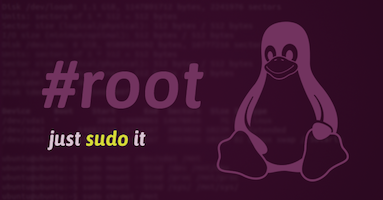

# Sudo Privileges



----

[Sudo][1] (su "do") allows a system administrator to delegate authority to give certain users (or groups of users) the ability to run some (or all) commands as root or another user while providing an audit trail of the commands and their arguments. For more information, see the introduction to Sudo. Sudo is free software, distributed under an ISC-style license.

----

## Usage

### Configuration

| Environment |  Value   |    Detail     |
| :---------: | :------: | :-----------: |
|    USER     | Require  | User account  |
|  PASSWORD   | Optional | User Password |


### Run script

Default

```bash
curl -fsSL https://raw.githubusercontent.com/c18s/LinuxScripts/master/sudo-privileges/sudo-privileges.sh | USER=system sh
```

Optional

```bash
curl -fsSL https://raw.githubusercontent.com/c18s/LinuxScripts/master/sudo-privileges/sudo-privileges.sh | USER=system PASSWORD=SECRET sh
```

## Reference

- :octocat: <https://github.com/c18s/LinuxScripts/tree/master/sudo-privileges>

[1]: https://www.sudo.ws
